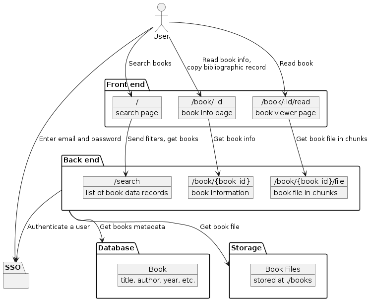
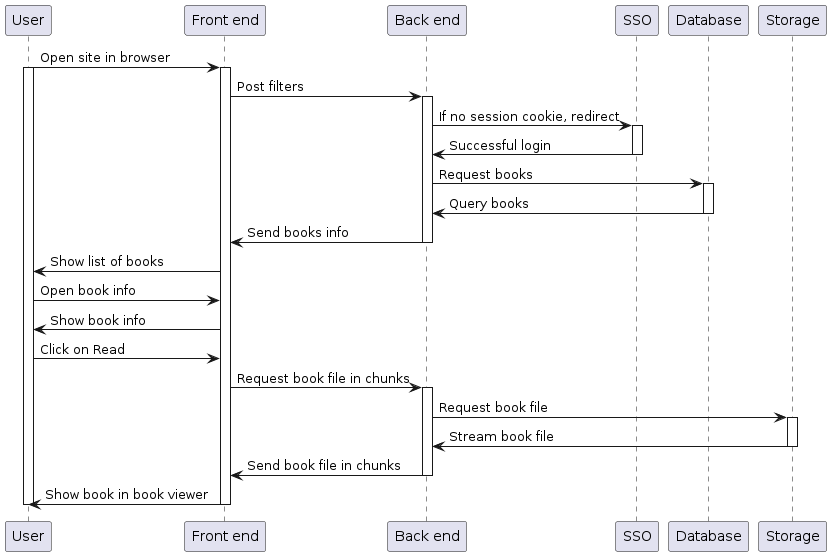

# Electronic Library of IU

<https://test.library.innopolis.university>

## Technical specification

[link](https://disk.yandex.ru/i/LyUBcA0CbtMhzA)

## Development

1. Install `Nix` ([link](https://github.com/deemp/flakes/blob/main/README/InstallNix.md#install-nix)) and `direnv`.

1. Clone and enter this repository

    ```console
    git clone https://gitlab.pg.innopolis.university/elibrary/elibrary
    cd elibrary
    ```

1. Run `direnv allow`.

1. Run `nix develop`. Check that you have `poetry` and `sqlite3` from a `devShell` (see [flake.nix](./flake.nix)).

    ```console
    poetry --version

    sqlite3 --version
    ```

1. Install packages.

    ```console
    nix run .#install
    ```

1. Build `pdfjs`.

    ```console
    nix run .#prodBuildPdfjs
    ```

1. Run dev servers (`back` and `front`).

    ```console
    nix run .#dev
    ```

1. (Optionally) Access back server at <http://0.0.0.0:5000>.

1. Access front server at <http://0.0.0.0:5001> in a browser.

1. Edit files in [back](./back) and in [front](./front/).

1. Stop servers.

    ```console
    nix run .#stop
    ```

## Production

1. Run server and monitoring containers.

    ```console
    docker compose up
    ```

1. Open server at <http://0.0.0.0:5000/>.

1. Open Grafana at <http://0.0.0.0:3000/d/fastapi-observability/fastapi-observability?orgId=1&refresh=5s>.
    - Login: `admin`
    - Password: `admin`
    - Skip updating password

## Connect by SSH

- Make a pair of `ED25519` SSH keys ([link](https://docs.gitlab.com/ee/user/ssh.html#generate-an-ssh-key-pair)).

- Add the key to your GitLab account ([link](https://docs.gitlab.com/ee/user/ssh.html#add-an-ssh-key-to-your-gitlab-account)).

- Set up an SSH agent ([link](https://docs.gitlab.com/ee/user/ssh.html#configure-ssh-to-point-to-a-different-directory)).
  - If on `Linux`, add this to your `~/.bashrc`

    ```console
    eval $(ssh-agent -s)
    ```

- Clone this repository by SSH.

    ```console
    git clone git@gitlab.pg.innopolis.university:elibrary/elibrary.git
    ```

## Security

- [sops](https://github.com/getsops/sops)
- [gnupg](https://www.gnupg.org/index.html)

1. Get both tools in a `devshell`:

    ```console
    nix develop
    sops --version
    gpg --version
    ```

1. The [back/auth.enc.env](back/auth.enc.env) file is encrypted via `sops`.

    - `GOOGLE_CLIENT_ID`, `GOOGLE_CLIENT_SECRET` are for [Google Open ID Connect](https://developers.google.com/identity/openid-connect/openid-connect)
    - `SECRET_KEY` is for sessions

1. The `sops` config is in [.sops.yaml](.sops.yaml).
1. A current developer (`Alice`) (whose key is in `.sops.yaml`) can grant access to a new developer (`Bob`).
    - Bob generates a PGP key pair via `gnupg` ([link](https://blog.gitguardian.com/a-comprehensive-guide-to-sops/#2-sops-with-pgp-keys)).
    - Alice adds Bob's public PGP key (e.g., `gpg --import bobs.public.key`).
    - Alice adds Bob's key fingerprint to [.sops.yaml](.sops.yaml).
    - Alice updates the encrypted file.

        ```console
        sops updatekeys back/auth.enc.env
        ```

## Stack

- main package manager: [nix](https://nixos.org/manual/nix/unstable/introduction)

### Back

- package manager: [poetry](https://python-poetry.org/docs/)
- database: [SQLite](https://www.sqlite.org/index.html)
- language: [Python](https://www.python.org/)
- framework: [FastAPI](https://github.com/tiangolo/fastapi)

### Front

- language: [TypeScript](https://www.typescriptlang.org/)
- framework: [React](https://react.dev/)
- tooling: [Vite](https://vitejs.dev/)
- book viewer: [PDF.js](https://github.com/mozilla/pdf.js)

### Monitoring

- containers manager: [Docker Compose](https://github.com/docker/compose)
- monitoring: [FastAPI with Observability](https://github.com/blueswen/fastapi-observability)

## Diagrams

### Use case


### Static view



### Dynamic view



## Contribute

1. Select/create an issue.

1. In its description, define steps to be completed.

1. Create a merge request [from the issue](https://docs.gitlab.com/ee/user/project/merge_requests/creating_merge_requests.html#from-an-issue) agains the `main` branch.

1. Describe the request using the default [closing pattern](https://docs.gitlab.com/ee/user/project/issues/managing_issues.html#closing-issues-automatically).

1. Switch to the merge request branch on your machine.

1. Work in that branch and periodically merge there the `main` branch.

1. If necessary, ask for a review.

1. Merge the request to the `main` branch.

## References

- [fastapi-observability](https://github.com/blueswen/fastapi-observability)
  - configure for compose ([link](https://grafana.com/docs/loki/latest/send-data/docker-driver/configuration/#configure-the-logging-driver-for-a-swarm-service-or-compose))
  - install docker loki plugin ([link](https://yuriktech.com/2020/03/21/Collecting-Docker-Logs-With-Loki/))

## License

The `MIT` license is used for the purpose of not resticting any usage of the software.